

  

  <a href="https://t.me/dwertyfa">Telegram ↗</a> &nbsp;·&nbsp;
  <a href="https://dwertyfa288.github.io/dwertyfa/">Портфолио ↗</a> &nbsp;·&nbsp;
  <a href="https://github.com/SpherePrime">SpherePrime ↗</a>

  

 

  

<a href="https://github.com/dwertyfa288/dwertyfa-astra-tg"></a>

<a href="https://github.com/dwertyfa288/astra-interject"></a>

<a href="https://dwertyfa288.github.io/dwertyfa/"></a>

 

  

<a href="https://novaprestige.ru/"></a>

<a href="https://roxyvpn.ru/"></a>

<a href="https://fazedanek-hub.github.io/danekmontage/"></a>

 

  

<a href="https://github.com/SpherePrime/PrimeProxy"></a>

<a href="https://github.com/SpherePrime/CLI"></a>

 

<a href="https://t.me/dwertyfa"></a>
