<a href="https://t.me/dwertyfa">Telegram ↗</a> &nbsp; · &nbsp; <a href="https://dwertyfa288.github.io/dwertyfa/">Портфолио ↗</a> &nbsp; · &nbsp; <a href="https://github.com/SpherePrime">SpherePrime ↗</a>

### Открыть проекты

**Избранное**

[TG for Astra ↗](https://github.com/dwertyfa288/dwertyfa-astra-tg) · [Astra Interject ↗](https://github.com/dwertyfa288/astra-interject) · [dwertyfa / portfolio ↗](https://dwertyfa288.github.io/dwertyfa/)

**Веб-проекты**

[Nova Prestige ↗](https://novaprestige.ru/) · [Roxy Boost ↗](https://roxyvpn.ru/) · [danek montage ↗](https://fazedanek-hub.github.io/danekmontage/) · [Hey Ksusha ↗](https://heyksusha.ru/intensive)

**SpherePrime**

[PrimeProxy ↗](https://github.com/SpherePrime/PrimeProxy) · [PrimeAI ↗](https://github.com/SpherePrime/PrimeAi) · [Prime CLI ↗](https://github.com/SpherePrime/CLI)

> SpherePrime — организация, в которой я состою. Здесь представлены её публичные проекты.
